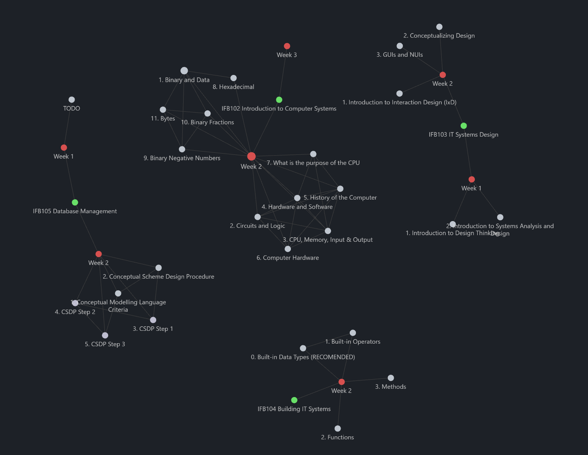

# University Notes (Bachelor of IT - Major Computer Science)

*Direct links in the PDFs to other files do not work.

Just a set of notes of everything being taught in my current bachelor. It's also gonna be used for a dataset in one of my ML projects

## Semester 1
### IFB102
- [Week 2](./IFB102/Week%202/Week%202.pdf)
- [Week 3 (TODO)](./IFB102/Week%203/Week%203.pdf)

### IFB103
- [Week 1](./IFB103/Week%201/Week%201.pdf)
- [Week 2](./IFB103/Week%202/Week%202.pdf)

### IFB104
- [Week 2](./IFB104/Week%202/Week%202.pdf)
- [Week 3](./IFB104/Week%203/Week%203.pdf)

### IFB105 (TODO)
- [Week 1 (TODO)](./IFB105/Week%201/Week%201.pdf)
- [Week 2 (TODO)](./IFB105/Week%202/Week%202.pdf)

